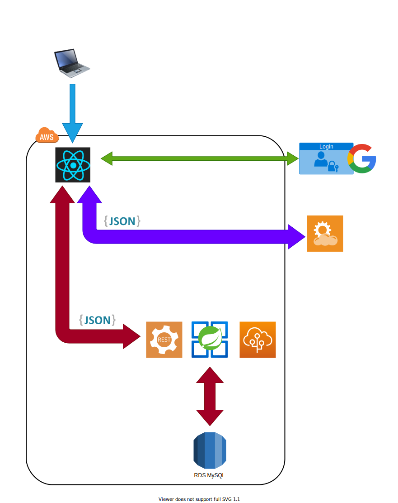
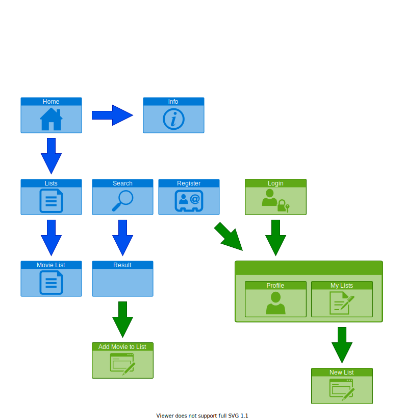
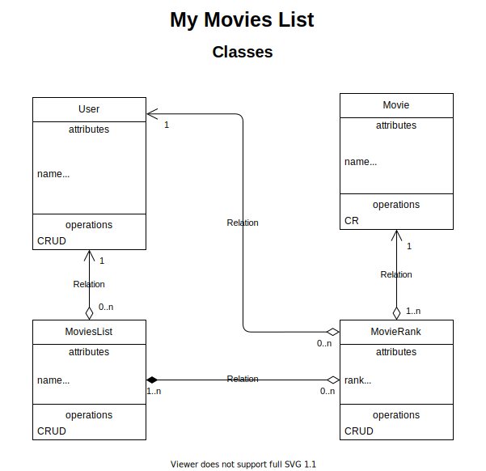

# mymovieslist

A Movies List project to study tech. This repository contains the documentation.

## Diagrams

<!-- This app will be hosted at: http://mymovieslist.appho.me -->

<!-- I'll be using some free movie APIs from https://rapidapi.com/ -->
