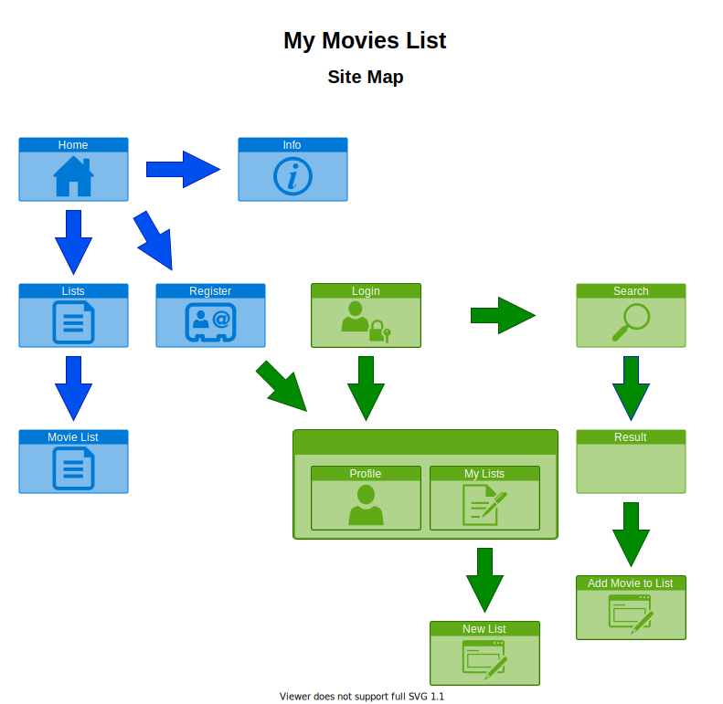
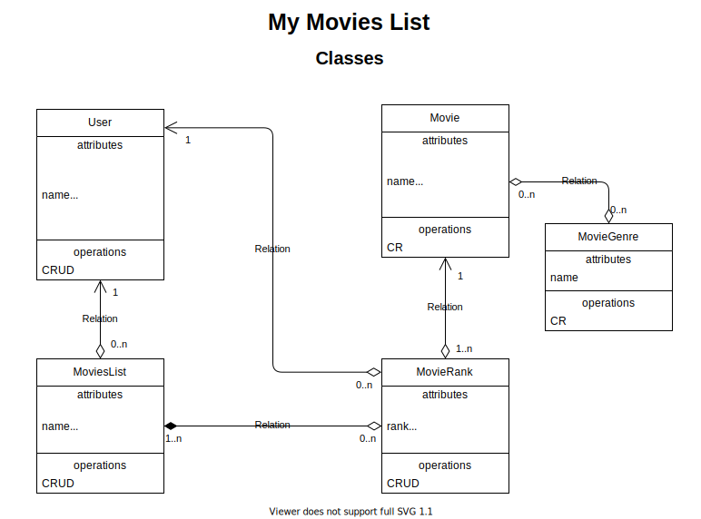

# My Movies List project

A Movies List project to study tech and showcase. This repository contains the documentation.

The code of the ReactJS front-end is available in the [mymovieslist-web](https://github.com/itamarc/mymovieslist-web) repository.

The code of the Spring back-end is available in the [mymovieslist-api](https://github.com/itamarc/mymovieslist-api) repository.

The database used during development was H2 and for production it will be MySQL.

The plan is to host and run all components in AWS.
<!-- This app will be hosted at: http://mymovieslist.appho.me -->

## Other documents

- [The description of the features and tech used in this project](FeaturesAndTech.md)

- [The REST API planned interface description](RESTAPI.md)

- [The external movies API that will be consumed](ExternalMoviesAPI.md)

## Diagrams

